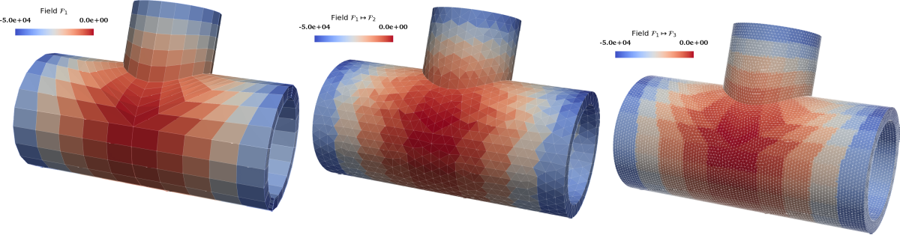

# Summary

SALOME [^1] is an open-source platform that offers researchers and engineers a comprehensive environment for numerical simulation pre- and post-processing tasks. Primarily developed by the French Alternative Energies and Atomic Energy Commission (CEA) and Électricité de France (EDF), SALOME is composed of different modules that provide: Computer Aided Design (CAD), meshing, mesh adaptation, data visualization, calculation supervision, and uncertainty quantification services. It supports complete computational workflows across a wide range of scientific and engineering domains, including computational fluid dynamics (CFD), structural mechanics, thermal analysis, and multiphysics coupling. Users can interact with these modules either through an intuitive graphical user interface (GUI) or through Python scripts, with full interoperability between both modes of operation. This dual-interface approach improves accessibility for novice users while providing flexibility for advanced practitioners, and enables efficient automation of complex workflows. A key feature of SALOME is its extensibility, allowing researchers and software developers to construct domain-specific applications by assembling and customizing its modules. This capability facilitates the development of tailored solutions for particular numerical simulation challenges, such as SALOME_CFD [@salomecfd] for fluid dynamics, SALOME_MECA [@AsterAster] for structural mechanics, and other domain-specific platforms that integrate custom solvers, visualization pipelines, or coupling strategies.

[^1]: SALOME stands for *Simulation numérique par Architecture Logicielle en Open source et à Méthodologie d'Évolution*, which translates to *Numerical Simulation using Open Source Software Architecture with Evolutionary Methodology*.

# Statement of need

Numerical simulations are central in modern scientific research and engineering, enabling the study of complex phenomena that are too costly, dangerous, or impractical to investigate through physical experiments alone. These allow researchers and engineers to forecast system behavior, optimize designs, and gain insights into various physical processes across multiple scales. A typical simulation workflow involves several key steps: computational geometry creation or import, mesh generation, setting up physical models and boundary conditions, numerical solution, and post-processing the results for analysis. Each of these steps requires specialized tools and expertise. Researchers and engineers working in areas such as fluid dynamics, structural mechanics, and multiphysics simulations require a comprehensive platform that can handle various aspects of the simulation workflow. Otherwise, the work must be distributed to multiple platforms or codes, which can be a tedious task. Hosting all these services under one roof is the primary aim of SALOME and constitutes its statement of need. In the next section we describe the dedicated modules present in SALOME that assist the pre- and post-processing tasks for numerical simulations.

# Software Design

SALOME is built on a modular architecture offering a comprehensive suite of tools for the entire simulation workflow.

## CAD

**SHAPER** and **GEOM** modules provide CAD capabilities built on top of [@occ]. While GEOM focuses on procedural, scripting-oriented geometry creation, SHAPER offers a modern, parametric, feature-based GUI. Key functionalities include:

- Interactive or Python-scripted creation of complex geometries.

![Left: magnet system of a nuclear fusion synchrotron (tokamak) geometry detailed in GEOM, from [@tactics], right: complex geometry detailed with SHAPER.\label{fig:example1}](./images/shaper_geom.png)

- Import/export for standard CAD formats (e.g., XAO, STEP, IGES, STL) to ensure interoperability.
- Advanced geometry cleaning, healing, and Boolean operations.
- Parametric modeling for easy geometry updates and parametric studies.

Figure \ref{fig:example1} displays industrial geometries generated by these modules, including a tokamak component constructed in GEOM and complex CAD in SHAPER.

## Mesh

**SMESH** is the meshing module of SALOME designed to produce meshes suitable for numerical simulation. For mesh generation, SMESH incorporates SALOME's in-house meshing algorithms, alongside open-source ones from Gmsh [@geuzaine2009gmsh] and NETGEN [@schoberl1997netgen], and commercial ones (MeshGems) from [@ds3]. SMESH provides:

- High-quality 0D–3D mesh generation, including high-order elements.
- Diverse element types (hexahedral, tetrahedral, polyhedral) and hybrid meshes.
- Algorithm mixing for versatile handling of complex geometry.
- Quality analysis, automatic correction, and extensive format support (e.g., MED, CGNS).

![Left: hybrid mesh of a nuclear reactor component, from [@bottcher2024cfd], right: hexahedral-core mesh.\label{fig:example2}](./images/smesh-new.png)

Figure \ref{fig:example2} illustrates SMESH's interoperability, combining algorithms like MeshGems, native viscous layers, and extrusion to mesh complex reactor components.

**HOMARD** performs mesh adaptation based on solution fields and refinement strategies, supporting iterative workflows (Figure \ref{fig:example3}).

**MEDCOUPLING** handles mesh/field data exchange, parallel interpolation, and co-simulation. Built on the MED format (a standardized data model for mesh and field data), it ensures interoperability between multiphysics codes (Figure \ref{fig:example}).

## Simulation Workflow and Supervision

**YACS** is SALOME’s module for coordinating multidisciplinary simulations involving the interaction of multiple physical models or codes. It allows users to design, automate, and control simulation workflows through a graphical interface or Python scripts, and supports both sequential and coupled execution strategies.

**EFICAS** is a module in SALOME that serves to generate multi-code inputs and environments. It handles multiple versions of supported codes through developer-defined “Catalogue” files that specify available commands and parameters.

**JOBMANAGER** is a module for managing the execution of simulation jobs on local or remote computing resources. It provides functionalities for job submission, monitoring, and resource allocation, streamlining the integration of simulation workflows with batch or HPC environments.

## Visualization

**PARAVIS** is SALOME’s integrated module for advanced data visualization, built on ParaView [@ayachit2015paraview]. It is accessible through both the graphical interface and Python scripts, and is extended with specialized plugins for numerical simulation post-processing. Notable features include visualization of mechanical fields at quadrature points, support for loading MED files, a static-mesh filter to accelerate post-processing of transient simulations, and tools for remeshing slices into triangular meshes. Figure \ref{fig:example4} presents two examples of simulation results visualized with PARAVIS.

## Uncertainty Quantification

**PERSALYS**, the graphical user interface of OpenTurns [@opeturns], is a native SALOME module developed by EDF for uncertainty quantification (UQ), sensitivity analysis, surrogate modeling, and optimization. It provides an intuitive interface for defining input uncertainties, building surrogate models, performing global sensitivity analyses, and managing optimization workflows. It enables robust parametric studies and uncertainty propagation through simulation chains with minimal setup effort.

# Research Impact Statement

SALOME is widely used in academia and industry, supporting research and development across multiple engineering disciplines. Below is a non-exhaustive list of recent solvers and platforms that integrate SALOME:

- [code_aster](https://code-aster.org/): state-of-the-art finite element solver for mechanics, relying on SALOME for geometry, meshing, and post-processing via SALOME_MECA [@AsterAster].
- [code_saturne](https://www.code-saturne.org): [@codesaturn] a parallel finite-volume CFD solver integrated into SALOME_CFD [@salomecfd].
- [Kratos Multiphysics](https://kratosmultiphysics.github.io/Kratos/): a parallel, multi-disciplinary FEM framework [@kartos]ported to SALOME [@kartosplugin].
- [AZTLAN platform](https://inis.iaea.org/search/searchsinglerecord.aspx?recordsFor=SingleRecord&RN=46065134): a Mexican platform for nuclear reactor analysis and design [@torres2015aztlan].
- DRAGON5/DONJON5: [@hebert2013dragon5] platforms for fission reactor simulation, including space applications, integrated into SALOME[@hebert2014integration].
- ALAMOS: a geometry and meshing tool for neutron physics in nuclear reactors [@tomatis2022overview]. 
- SMARDDA: a plasma–surface interaction module for tokamak design using SALOME for GUI, CAD, meshing, and visualization [@kos2019smiter]. 
- McCAD: a geometry conversion tool for Monte Carlo simulations that uses SALOME for CAD manipulation and material assignment [@jne4020031].

SALOME has also been used as a component in numerical simulations reported in recent publications covering FEM–FVM coupling [@barbi2021femus; @zerkak2007lwr], molecular dynamics [@biagooi2020effects], nuclear engineering [@aydemir2019coupling; @zhang2021development], aerospace engineering [@ermakov2020generation], and magnet design [@nunio2011salome; @pirapakaran2023fft].

# Documentation and Availability

Comprehensive tutorials and detailed user and developer documentation are available for all SALOME modules [@salomedoc].

SALOME provides precompiled binaries for Linux and Windows, along with the SAT tool for building from source. Ready-to-use binaries are available from the official SALOME website (https://www.salome-platform.org/).

# AI Usage Disclosure

AI tools were used for minor editorial support and language polishing during the preparation of this manuscript. All software-related aspects, including source code, development, desgin, testing, and validation, were carried out and verified by human developers and contributors.

# Acknowledgements

We thank CEA and EDF for financing SALOME over the past 20 years. We also acknowledge Open CASCADE for their extensive development and support, alongside the many contributors who have shaped SALOMEs evolution.

# References
