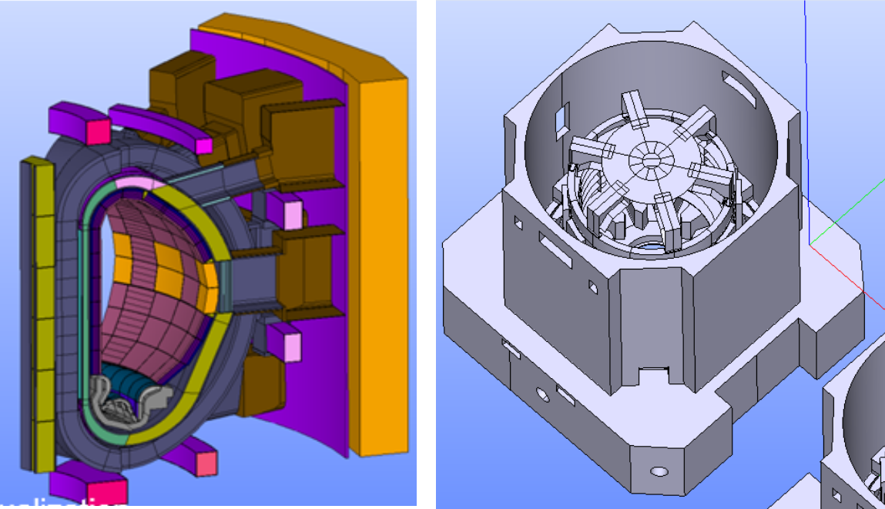
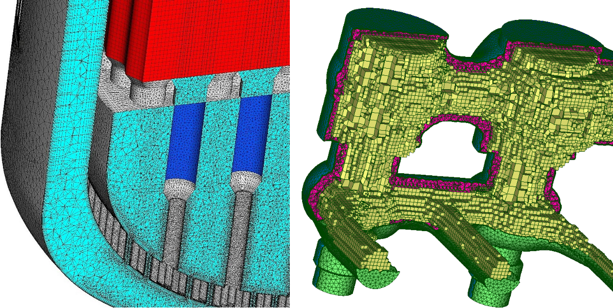
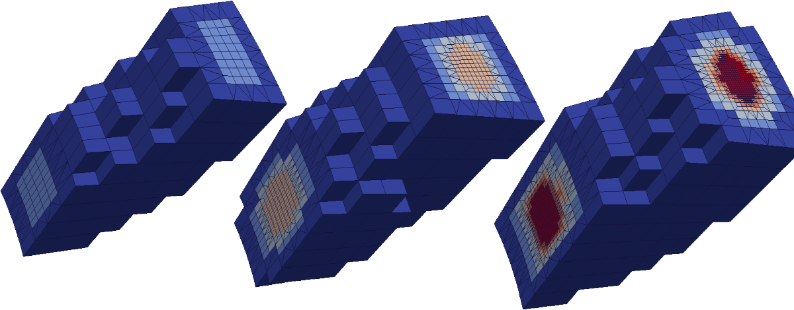
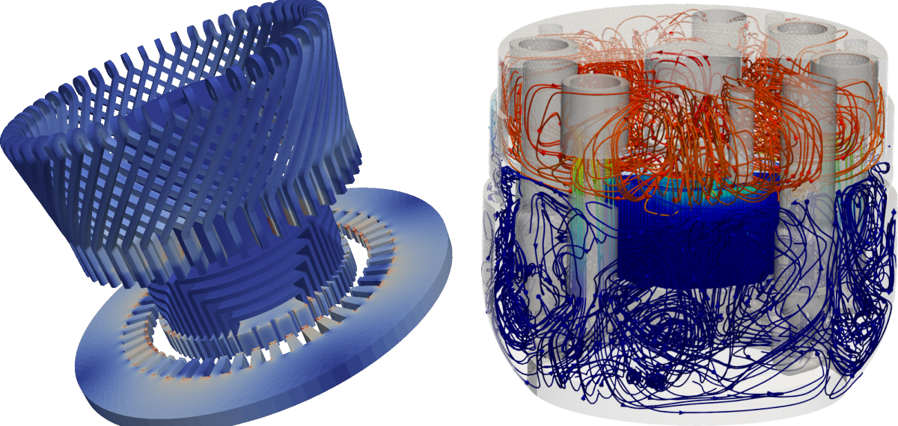

# Summary

SALOME is acronym for "Simulation numérique par Architecture Logicielle en Open source et à Méthodologie d'Évolution" which translates to "Numerical Simulation using Open Source Software Architecture with Evolutionary Methodology" in English. As the name suggests, SALOME is an open-source platform for numerical simulation  which offers  researchers and engineers with a comprehensive environment for pre- and post-processing tasks associated to numerical simulations. SALOME  is composed of different modules that provide:  Computer Aided Design (CAD), meshing, mesh adaptation, data visualization, calculation supervision, and uncertainty quantification services, thereby facilitating the entire workflow of computational studies across various scientific and engineering disciplines.  Users can interact with these modules through an intuitive graphical user interface (GUI) or via Python scripts, with full interoperability between these two modes of operation. This dual-interface approach enhances both accessibility for novice users and provides flexibility for advanced practitioners. Moreover, this enables efficient automation of complex workflows. A key feature of SALOME is its extensibility, allowing researchers and software developers to construct domain-specific applications by assembling and customizing its modules. This capability facilitates the development of tailored solutions for particular numerical simulation challenges.

# Statement of need

Numerical simulations are prominent in modern scientific research and engineering, enabling the study of complex phenomena that are too costly, dangerous, or impractical to investigate through physical experiments alone. These allow researchers and engineers to forecast system behavior, optimize designs, and gain insights into various physical processes across multiple scales. A typical simulation workflow involves several key steps: computational geometry creation or import, mesh generation, setting up physical models and boundary conditions, solving the problem numerically, and post-processing the results for analysis. Each of these steps  require specialized tools and expertise. Researchers and engineers in fields of numerical simulations such as  fluid dynamics, structural mechanics, and other multiphysics scenarios  require a comprehensive platform that can handle various aspects of the simulation workflow. Otherwise the work has to be distributed to multiple platforms or codes, which can be a tedious task.  Hosting all these services under one roof is the primary aim of SALOME platform or in other words SALOME's statement of need.   In the next section we detail on dedicated modules present in SALOME that assist the pre- and post-processing tasks for a numerical simulation. 

## Functionality

SALOME is built on a modular architecture, offering a comprehensive suite of tools for the entire simulation workflow.  Below, point-wise, we briefly elaborate on key modules of SALOME:

1. SHAPER & GEOM: These modules form the backbone of SALOME's CAD handling capabilities. Both of these modules are built on top of @occ. Among the key functionalities of these modules are:
   - Creation and modification of complex geometries, interactively via the GUI or via a Python script. The Python script here is a set of swigged C++ functions running to perform the required CAD task.

   

   - Import/export  support for a wide range of CAD formats e.g., XAO, STEP, IGES, BREP, STL, etc., this permits interoperability between different platforms/codes.    
   - Advanced geometry cleaning and healing tools to repair imperfections.
   - CAD editing features including boolean operations, fillets, and chamfers.
   - Parametric modeling for easy geometry updates and parametric studies.

   See Figure \ref{fig:example1} for examples of complex industrial CAD geometries generated with these modules.  A part of tokamak   constructed using GEOM (Figure \ref{fig:example1}-left) and a geometry of @@@@@@@ constructed using SHAPER (Figure \ref{fig:example1}-right).

2. SMESH:  A versatile meshing module of SALOME with objectives of producing numerical simulation ready meshes. For mesh generation, SMESH incorporates SALOME's in-house meshing algorithms, alongside open-source ones from  Gmsh @geuzaine2009gmsh and NETGEN @schoberl1997netgen, and commercial ones (MeshGems) from @ds3. Briefly, SMESH  provides:

   - Generation of high-quality meshes in 0D, 1D, 2D, and 3D. Meshes can also be of higher order in nature.
   - Support for various element types: hexahedral, tetrahedral, pyramids, prisms,  polyhedral, quadrangular, triangular,  and hybrid meshes.
   - Multiple meshing algorithms suitable for different geometry types. Different algorithms can be mixed to produce versatile hybrid meshes. 
   - Mesh quality analysis tools and automatic mesh correction features. 
   - Import/export capabilities for numerous mesh formats (e.g., MED, UNV, CGNS, Mesh, STL).

   

   Figure \ref{fig:example2} presents two hybrid meshes constructed using SMESH. The left one uses MeshGems MG-CADSurf algorithm to mesh the surface in triangles, SALOME's built-in viscous layers algorithm to generate prisms, MeshGems MG-Tetra algorithm to generate tetrahedra, and SALOME's built-in Quadrangle mapping and Extrusion algorithms to generate hexahedra. This case highlights one of the key features of SMESH, i.e., interoperability between different algorithms in order to meet with the demands of this complex mesh. The mesh on the right uses MeshGems MG-CADSurf and  MG-Hybrid algorithms to generate triangles, tetrahedra, pyramids, and hexahedra.

3. HOMARD: SALOME's module for adapting meshes given an input field from a numerical solution. HOMARD also supports uniform mesh refinement based on subdivision method. Meshes can also  be adapted in SMESH via specialized plugins that target mesh adaption  based on numerical simulation fields. Figure \ref{fig:example3} provides a demonstration of iterative mesh adaption process achieved using HOMARD. 

4. YACS: Multidisciplinary simulations persist in many real world problems where multiple physics interact and this is often  achieved by coupling the existing codes.  SALOME's YACS module is a tool for managing such multidisciplinary simulations through calculation schemes which  provides a means of defining a chain or coupling of calculation codes.

5. PARAVIS: For advanced data visualization based on state-of-the-art visualization, SALOME integrates ParaView, @ayachit2015paraview, in SALOME's graphic user interface and python scripts and enhances it with additional plugins, with  capacity to visualize mechanical fields at quadrature points, capacity to load MED files, static-mesh filter which improves performance of post-processing  for transient simulations, capabilities of remeshing slices to triangular meshes from post-processed data, etc. Figure \ref{fig:example4} presents two examples of post-processed numerical simulations obtained with PARAVIS.  

   

6. MEDCOUPLING: SALOME's module for mesh data management and interpolation of simulation fields on a mesh. This module also features parallel mesh interpolation. @@@@@@ WRITE MORE. 

 

For each of these  SALOME modules presented above, tutorials to get users started and user/developer documentations exist, c.f. @salomedoc. Moreover, other SALOME modules like HEXABLOCK, ADAO, JobManager, Eficas, PERSALYS, etc, have not been detailed in the paper for conciseness. Interested readers may refer to  @salomedoc.

## Impact and Reuse Potential

SALOME has been widely adopted in both academic and industrial settings, contributing to research and development in various engineering and research disciplines. The following list presents a non-exhaustive list of some recent solvers/platforms that have used SALOME:

- [code_aster](https://code-aster.org/): a state-of-the-art finite element solver to solve problems in mechanics. This solver heavily relies on SALOMEs capacity to produce complex geometries, meshes, and post-processing  is delivered  with SALOME_MECA, c.f. @AsterAster.
- [code_saturne](https://www.code-saturne.org): @archambeau2004code a parallel FVM based general purpose Computational Fluid Dynamics (CFD) software, which has been integrated to SALOME_CFD, c.f. @salomecfd.
- [Kratos Multiphysics](https://kratosmultiphysics.github.io/Kratos/): a parallel, multi-disciplinary FEM based simulation software @kartos, which has been ported in SALOME, c.f. @kartosplugin.
- [AZTLAN platform](https://inis.iaea.org/search/searchsinglerecord.aspx?recordsFor=SingleRecord&RN=46065134): Mexican platform for analysis and design of nuclear reactors @torres2015aztlan.
- DRAGON5/DONJON5: @hebert2013dragon5  platforms for designing computational schemes dedicated to fission nuclear reactors for space  which has been ported to SALOME, @hebert2014integration.
- ALAMOS: geometry and mesh designing package for neutron physics involved in nuclear reactors @tomatis2022overview. 
- SMARDDA: module for plasma interaction with complex engineered surfaces for tokomak design uses SALOME for GUI, CAD, mesh, and visualization, @kos2019smiter. 
- McCAD: a geometry conversion tool to enable the automatic  conversions of CAD models into the Monte Carlo (MC) geometries, uses SALOME for CAD manipulations and material assignment, c.f. @jne4020031.

These examples make it clear the open-source nature of SALOME encourages community contributions and adaptations for specific use cases, enhancing its reuse potential across different domains of numerical simulation.

The following recent publications used SALOME as one of the components for their numerical simulations: FEM-FVM coupling @barbi2021femus, @zerkak2007lwr, molecular dynamics @biagooi2020effects, nuclear engineering @aydemir2019coupling, @zhang2021development, aerospace @ermakov2020generation, and magnet-design @nunio2011salome and @pirapakaran2023fft, etc.

One of the forces of SALOME is also that we provide precompiled binaries for Linux and Windows. We also provides a tool named SAT that can assist  compilation of SALOME from scratch.  These ready to use binaries are made available on SALOME's official website (https://www.salome-platform.org/).

# Acknowledgements

We would like to thank  @@@@@@@ , @@@@@@@ , @@@@@@@ , @@@@@@@ , @@@@@@@ , @@@@@@@. Since SALOME was an evolutive effort of 20+ years, authors would like to thank @@@@@@@ @@@@@@@, @@@@@@@, @@@@@@@ for their sincerer  contributions. 

# References
